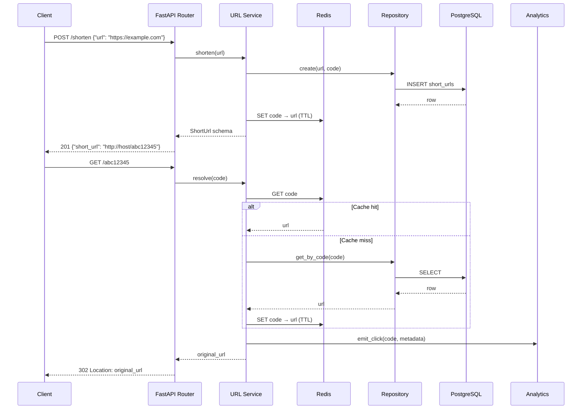

# Architecture: Agentic SDLC URL Shortener

> **Classification:** Interview Assignment — Schwab Internal  
> **Version:** 0.1.0 | **Status:** Foundation (Step 1 of 9)

---

## 1. System Overview

This system is a **two-layer architecture**:

| Layer | Purpose |
|---|---|
| **Agentic Orchestration Layer** | Drives the full SDLC lifecycle (requirements → design → implement → test → docs → release) using a dependency-aware DAG engine with governance controls |
| **URL Shortener Service** | Production-quality REST API that is the *artifact* produced by the orchestrator; demonstrates real engineering output |

The orchestrator is not a wrapper around the URL shortener — it is a general-purpose SDLC engine. The URL shortener is what it builds. This separation means the orchestrator could drive any future service by swapping in different stage implementations.

---

## 2. Orchestration Model

### 2.1 DAG Structure

The SDLC lifecycle is modelled as a directed acyclic graph (DAG) using `networkx`. Each node is an SDLC stage; edges represent dependencies.

```
┌──────────────────┐
│  Requirements    │  ← entry gate: raw_text present
└────────┬─────────┘
         │
┌────────▼─────────┐
│     Design       │  ← entry gate: normalized_text + acceptance criteria
└──┬───────────┬───┘
   │           │         ← parallel branch
┌──▼──────┐ ┌──▼──────┐
│Implement│ │  Docs   │  ← can execute concurrently
└──┬──────┘ └──┬──────┘
   │           │         ← synchronization barrier
   └─────┬─────┘
┌────────▼─────────┐
│      Test        │  ← entry gate: implementation artifacts present
└────────┬─────────┘
         │
┌────────▼─────────┐
│     Release      │  ← requires_approval=True (human checkpoint)
└──────────────────┘
```

### 2.2 Entry and Exit Gates

Every stage has two gates:

- **Entry gate** — evaluated before execution begins. Checks upstream artifact availability, policy constraints, and dependency completion. If it fails, the stage is blocked (not retried).
- **Exit gate** — evaluated after execution completes. Checks output quality (test coverage, security scan result, artifact completeness). If it fails, the retry chain begins.

Gate results are recorded as `GateResult` objects in the `StageContext` for full traceability.

### 2.3 State Persistence

After every status transition the `WorkflowState` is serialized to a JSON file (configurable via `STATE_FILE_PATH`). This means:
- A crash during any stage does not lose progress
- `resume()` reloads state from disk and continues from the last checkpoint
- Audit replay is always available from the persisted JSON

In later steps, state persistence will optionally target a PostgreSQL table instead of a file.

### 2.4 Human Approval Checkpoints

Stages marked `requires_approval=True` (currently: Release) block execution and emit a structured approval request. The orchestrator:

1. Logs the approval request to the audit trail
2. Polls for a human decision (CLI, webhook, or future API)
3. Times out after `APPROVAL_TIMEOUT_SECONDS` (default 300s) — treated as **rejection** (fail-safe)
4. Records the decision (approved / rejected / timed-out) in the audit trail with actor identity

### 2.5 Retry, Fallback, and Rollback

```
Stage execution attempt N
    ↓ exit gate FAILS
    ↓ has_retries_remaining?
    ├── YES → exponential backoff (tenacity) → attempt N+1
    └── NO  → fallback path (if defined) → else rollback

Rollback chain:
    Current stage rollback()
    ↓ propagate upstream if cascade=True
    ↓ mark WorkflowState.status = ROLLED_BACK
    ↓ log to audit trail
```

Retry configuration: `MAX_STAGE_RETRIES=3`, backoff multiplier 2×, max wait 30s.

### 2.6 Safe-Stop Mechanism

An operator can call `stop(workflow_id)` at any time. The engine:
1. Sets a stop flag checked at every synchronization point
2. Finishes the current atomic operation (never mid-write)
3. Calls `rollback()` on the in-progress stage
4. Persists state with `status=STOPPED`
5. Emits a `workflow_stopped` audit entry

### 2.7 Policy Guardrails

Implemented in `orchestrator/policies/` (Step 6):

| Policy | When Applied | Action on Failure |
|---|---|---|
| Security scan | Before Release gate | Block stage, raise alert |
| Compliance check | Before Design exit gate | Block stage |
| Change control | Before Release approval request | Require additional approver |
| PII guard | After every agent output | Redact and warn |

### 2.8 Observability

| Concern | Implementation |
|---|---|
| Structured logs | `structlog` — JSON in production, console in dev |
| Audit trail | `AuditEntry` list on `WorkflowState`; append-only |
| Metrics | `prometheus-client`: success rate, retry count, MTTR, e2e latency |
| Traceability | Every gate result, retry, approval, and rollback logged with timestamp + actor |

### 2.9 Dynamic Re-planning

When an upstream stage's output changes (e.g., requirements are clarified mid-run), the orchestrator:
1. Detects changed output keys in `StageContext.output_data`
2. Identifies all downstream DAG nodes
3. Resets their status to `PENDING` and re-evaluates entry gates
4. Records a `replan_triggered` audit entry with the changed keys

---

## 3. URL Shortener Service

### 3.1 Component Breakdown

```
url_shortener/
├── main.py          FastAPI app factory; registers routers; owns lifespan
├── config.py        pydantic-settings Settings; all config from env vars
├── api/             FastAPI routers (added in Step 2)
│   ├── urls.py      POST /shorten, GET /{code}, DELETE /{code}
│   ├── analytics.py GET /{code}/stats, GET /analytics/summary
│   └── ops.py       GET /health, GET /metrics
├── models/          SQLAlchemy ORM models (Step 2)
│   ├── url.py       ShortUrl table
│   └── click.py     ClickEvent table
├── schemas/         Pydantic request/response schemas (Step 2)
├── services/        Business logic (Step 2)
│   └── url_service.py  shorten(), resolve(), delete()
├── repositories/    Async DB access (Step 2)
│   └── url_repo.py  CRUD + read/write split
└── analytics/       Click tracking + aggregation (Step 3)
    └── tracker.py
```

### 3.2 Data Flow



### 3.3 API Design (Planned)

| Method | Path | Description | Auth |
|---|---|---|---|
| `POST` | `/shorten` | Create a short URL | None (Step 2) |
| `GET` | `/{code}` | Redirect to original URL | None |
| `DELETE` | `/{code}` | Delete a short URL | API key (Step 3) |
| `GET` | `/{code}/stats` | Click analytics for a code | None |
| `GET` | `/analytics/summary` | Aggregate analytics | None |
| `GET` | `/health` | Liveness probe | None |
| `GET` | `/metrics` | Prometheus metrics | Internal |

---

## 4. Three Scenarios

### 4.1 Greenfield — Build from Scratch
The orchestrator runs the full DAG to produce the URL shortener service:
- **Requirements stage**: normalises the raw spec, identifies acceptance criteria
- **Design stage**: produces OpenAPI schema + data model
- **Implement stage**: generates service, repository, and API code
- **Test stage**: generates and runs pytest suite; exit gate requires ≥80% coverage
- **Docs stage**: generates architecture.md and OpenAPI docs (parallel with Implement)
- **Release stage**: requires human approval; tags release and emits changelog

### 4.2 Brownfield — Custom Alias Feature
The orchestrator adds a custom-alias feature to the running service:
- **Codebase reasoning**: identifies `url_shortener/services/url_service.py`, `url_shortener/models/url.py`, and `url_shortener/api/urls.py` as impacted
- **Impact analysis**: detects that adding an `alias` column requires an Alembic migration
- **Design stage**: produces diff-level design (new field, new validation, migration)
- **Implement stage**: applies targeted changes to identified files only
- **Test stage**: runs regression suite + new alias-specific tests

### 4.3 Ambiguous — "Make It Faster"
The orchestrator handles an underspecified requirement:
- **Requirements stage**: detects ambiguity (no metric, no baseline, no scope)
- **Clarification loop**: emits structured questions and blocks at a human checkpoint
- **After resolution**: normalises to "reduce p99 redirect latency from ~200ms to <50ms via Redis cache-aside"
- **Design stage**: produces cache-aside implementation plan
- **Implements and validates** against the agreed metric before closing

---

## 5. Key Design Decisions

| Decision | Rationale | Trade-off |
|---|---|---|
| **networkx DAG over linear chain** | Enables parallel stages (Implement + Docs) and dynamic re-planning; gate evaluation is a graph traversal | More complex to debug than a simple list |
| **StageContext as immutable-ish value object** | Enables audit replay and rollback without side effects | Slightly more verbose to update state |
| **File-backed state persistence (JSON)** | Zero infrastructure dependency for demos; no DB required to run the orchestrator | Not suitable for concurrent workflows; will migrate to DB in Step 4 |
| **pydantic-settings for all config** | Type-safe, documented, testable; secrets always from env vars | Requires env setup before running; mitigated by `.env.example` |
| **FastAPI app factory pattern** | Allows test code to inject custom settings without env var mutation | Slightly more boilerplate in `main.py` |
| **Abstract base classes for Agent/Stage/Orchestrator** | Forces a stable interface contract; enables mocking in tests from day one | Requires every implementor to be explicit about all methods |
| **Approval timeout defaults to rejection** | Fail-safe: an unattended system never proceeds past a governance checkpoint | May frustrate demos; timeout is configurable |

---

## 6. Reliability Targets

| Metric | Target |
|---|---|
| p99 redirect latency (cache hit) | < 50 ms |
| p99 redirect latency (cache miss) | < 200 ms |
| Service availability | 99.9% uptime |
| Rate limit | 100 req/min per IP |
| Short-code collision rate | < 0.01% (DB unique constraint + retry) |
| Orchestrator stage success rate | Tracked via Prometheus; alert at < 95% |

---

## 7. Security Considerations

| Concern | Mitigation |
|---|---|
| Malicious URL input | Scheme whitelist (http/https only); max URL length 2048 chars; `validators` library |
| Open redirect abuse | No user-controllable redirect targets beyond the stored original URL |
| Rate limiting | Redis token bucket per IP; configurable `RATE_LIMIT_PER_MINUTE` |
| Secrets in config | All secrets via env vars; `.env` in `.gitignore`; `.env.example` has no real values |
| PII in logs | No URL content, user-agent, or IP logged; only short-code and timestamp |
| Audit log integrity | Append-only `AuditEntry` list; no delete API exposed |
| Short-code enumeration | ULIDs are not guessable; codes are not sequential |

---

## 8. Setup & Running

### Prerequisites
- Docker Desktop (or Docker Engine + Compose plugin)
- Python 3.11+ (for local development without Docker)

### Quick Start (Docker)
```bash
git clone <repo>
cd agentic-sdlc-url-shortener
cp .env.example .env          # review and adjust if needed
docker-compose up --build
# API available at http://localhost:8000
# Docs at http://localhost:8000/docs
```

### Local Development
```bash
python -m venv .venv
source .venv/bin/activate     # Windows: .venv\Scripts\activate
pip install -e ".[dev]"
cp .env.example .env
# Start postgres and redis (or use docker-compose for infra only)
docker-compose up postgres redis -d
uvicorn url_shortener.main:app --reload
```

### Running Tests
```bash
pytest                              # all unit tests
pytest -m unit                     # unit only (no infra required)
pytest -m integration              # requires postgres + redis
pytest --cov=orchestrator --cov=url_shortener --cov-report=html
```

---

## 9. Implementation Roadmap

| Step | Scope |
|---|---|
| **1 (current)** | Project scaffold: directory structure, config, base abstractions, logging, tests structure |
| **2** | URL Shortener core: models, schemas, repositories, service, API routers, Alembic migration |
| **3** | Analytics + reliability: click tracking, stats endpoints, rate limiting, Prometheus metrics |
| **4** | Orchestration engine: DAG executor, state machine, gate evaluator, retry logic, state persistence |
| **5** | SDLC stage executors: Requirements, Design, Implement, Test, Docs, Release stages |
| **6** | Governance: human approval checkpoints, policy guardrails, audit log emission, metrics |
| **7** | Greenfield scenario: end-to-end orchestrator run producing the URL shortener |
| **8** | Brownfield + Ambiguous scenarios: codebase reasoning, intent parsing, clarification loop |
| **9** | Full test suite + engineering summary: unit, integration, orchestrator tests; final docs |
